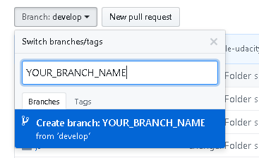

# Google India Scholar Collaborative Project- Mobile Web Specialist (MWS) Phase 2

Hi,You've got this template to edit as you start with the Collaborative Projects in Phase 2 and commit your changes. Please read this (https://docs.google.com/document/d/18UC6AAfdgcLLZzuGO_unUlZwc2kBYZqBRogmjDK3Ysc/edit?usp=sharing) document very carefully to understand all the details about the Collaborative Projects.

**Team**
- (Add your or your teammates slack Handle here)
- [@bunny.mws](https://www.linkedin.com/in/sourya-v-8614b979)
- [@Abdul Kadir.mws](https://www.linkedin.com/in/abdul-kadir-olia-3a898712b)
- [@dharmateja.mws](https://www.linkedin.com/in/cdharmateja/)
- [@Siddiqi.mws](https://in.linkedin.com/in/istiaquesiddiqi)
- Looking for teammates

## Table of Contents

- [Getting Started](#getting-started)
- [Project URL](#project-url)
  - [Screenshots](#screenshots)
- [Folder Structure](#folder-structure)
- [Prerequisites](#prerequisites)
- [How to launch the app locally](#how-to-launch-the-app-locally)
  - [Installation](#installation)
- [Style Guide](#style-guide)
- [Resources](#resources)
- [Acknowledgments](#acknowledgments)

## Getting Started
- Step 1: Create your branch from develop branch only

  
  
- Step 2: Get copy of the repo on your system
  ```
  # git clone https://github.com/google-udacity-india-scholars/mws-track-gifs.git
  # cd mws-track-gifs
  ```
- Step 3: Ensure you are in a develop branch
  ```
  # git branch
  ```
- Step 4: Now start contributing by going into your branch
  ```
  # git fetch && git checkout <YOUR_BRANCH_NAME>
  ```
- Step 5: After you are done ONLY commit those files on which you coded and raise PR.

## Project Title
Gify

## Project Description
This project is about creating Progressive Web App(PWA) that lists animated gifs for different category, users can view trending gifs, search and create gif for any word, mark their favourite gifs, share gifs with others, can browase gifs in offline as well.

**Features**

-	Gets all the trending animated Gifs.
-	Search Gif.
-	Create gif from word.
-	Get animated gif for different categories like birthday, greetings, happy, sad, crying,     
  wedding, greetings, etc.
-	Share gif with others.
-	Save your favorite gifs.
-	Works in offline.

As a benchmark we will follow Restaurant Reviews: Stage 2 Rubrics

And one needs to get their API key from from GIPHY https://giphy.com/ and it is an open source api for GIFS and images.

## Project URL
[Visit the app](#)

In case you have any!

### Screenshots


## Folder Structure
In case there are any files please add them here as an Hierarchy for it to be better understandable.
```bash
├── README.md - This file.
├── 
└── 
```

## Prerequisites
* Which ever the project you choose it should be strictly following any of the rubri/instructions in the Nanodegree Program

## How to launch the app locally?

* For development, use `gulp browser-sync`.
* For production, Use `gulp clean` and `gulp` for creating production build. Go to `prod` folder run `python3 -m http.server` to run the production server.

### Installation

```
# npm i
# npm i -g gulp-cli
```

## Project Rubric Level
MWS - Restaurant Reviews: Stage 2

## Acknowledgments
Add an Achowledgement if you want to add any.

## Project Moderators

Please reach out to respective Mods for any quries about the Collaborative Projects!

**AND** 
- @Green_little_robot_.and
- @TavishJain.and
- @Shivam.and

**ABND** 
- @ak003.abnd

**FEND** 
- @GauravSingh.FEND

**MWS** 
- @Abhishekji.mws
- @smriti.mws
- @Siddiqi.mws
